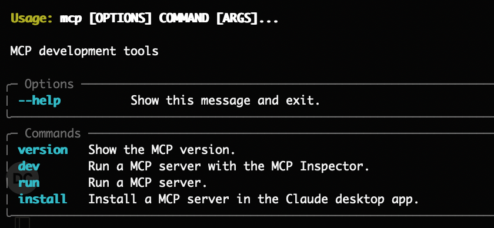
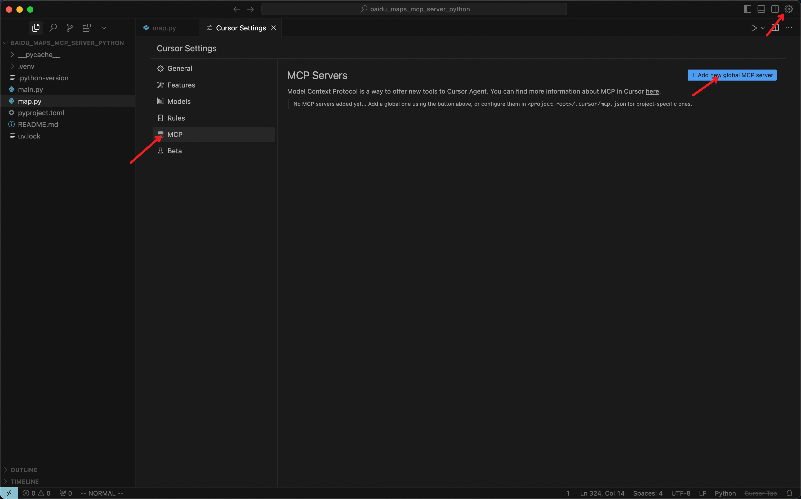
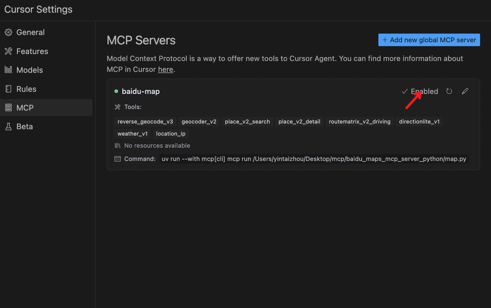
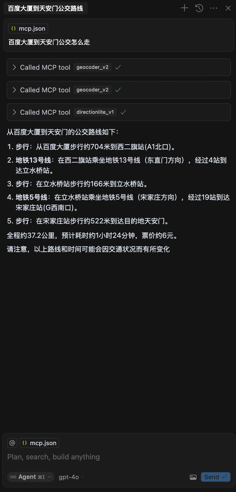
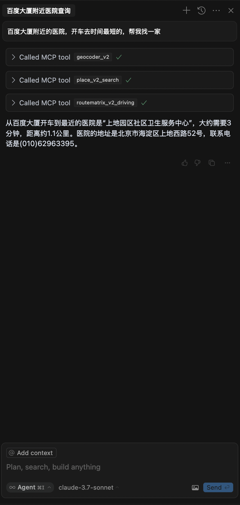
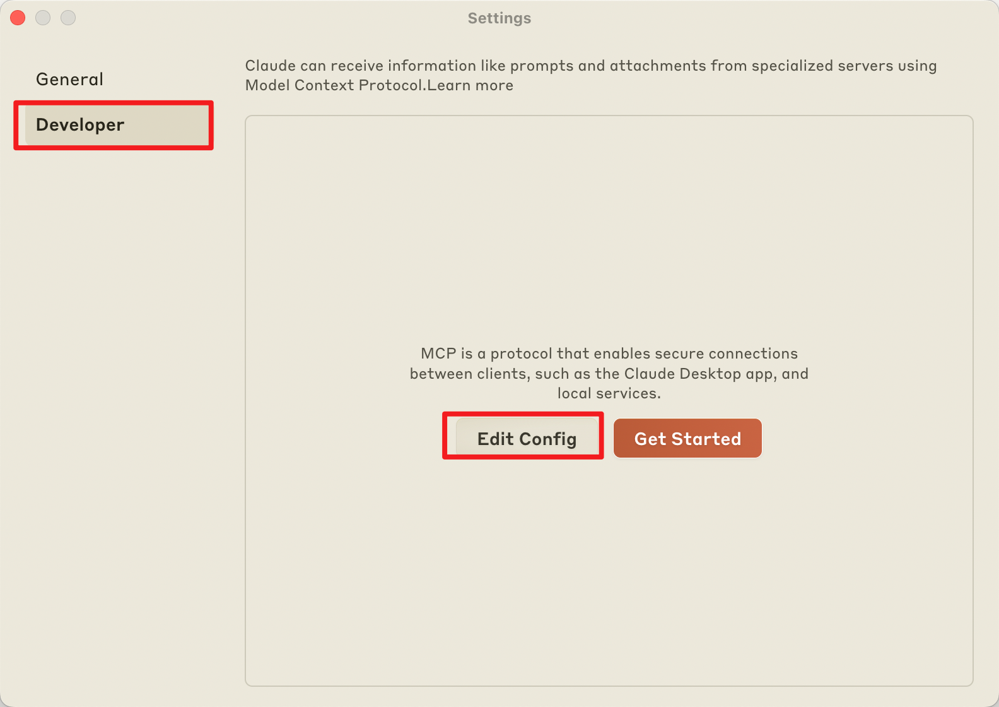
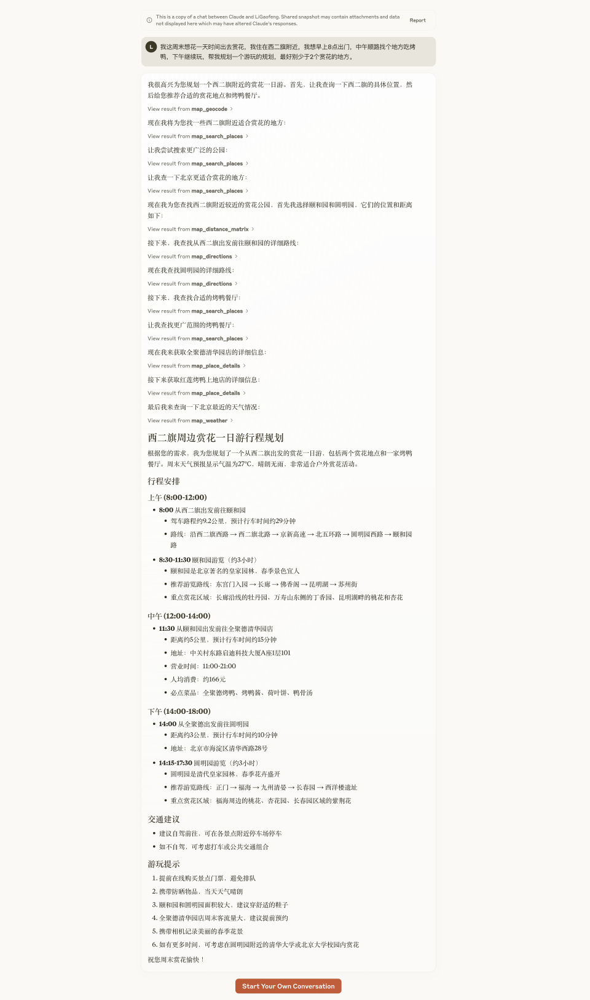
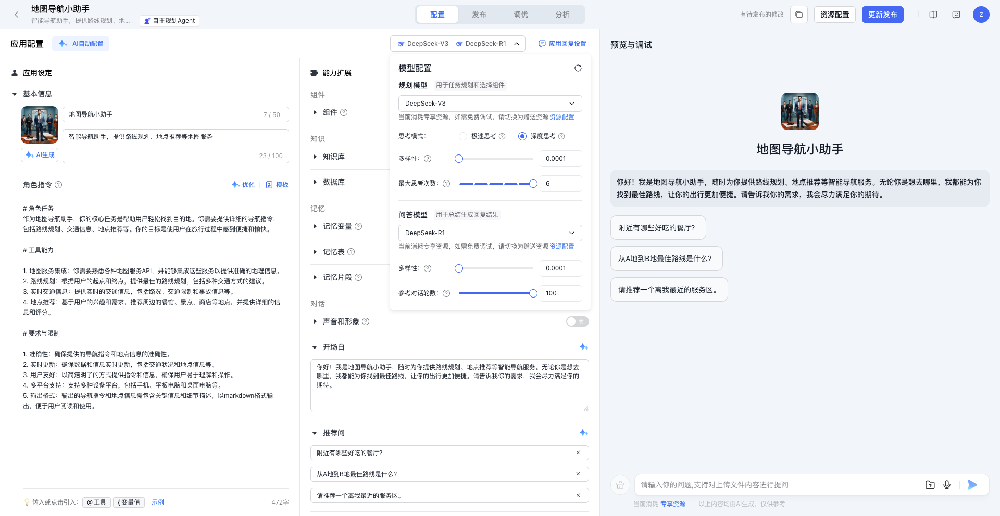
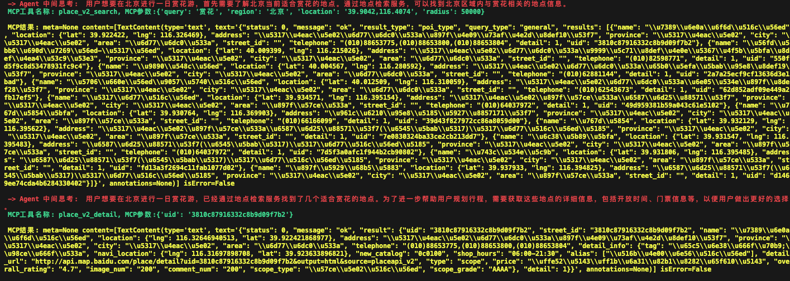

# 百度地图 MCP Server

## 简介

百度地图核心API现已全面兼容MCP协议，是国内首家兼容MCP协议的地图服务商。关于MCP协议，详见MCP官方[文档](https://modelcontextprotocol.io/)。

目前提供的MCP工具列表包含8个核心API接口和MCP协议的对接， 涵盖逆地理编码、地点检索、路线规划等。

依赖`MCP Python SDK`和`MCP Typescript SDK`开发，任意支持MCP协议的智能体助手（如`Claude`、`Cursor`以及`千帆AppBuilder`等）都可以快速接入。

以下会给更出详细的适配说明。

## 工具列表

1. 地理编码 `geocoder_v2`
   - 将地址解析为对应的位置坐标
   - 输入: `address`
   - 输出: `location`
  

2. 逆地理编码 `reverse_geocoding_v3`
   - 将坐标点转换为对应语义化地址
   - 输入: `location`
   - 输出: `formatted_address`, `uid`, `addressComponent`

3. 地点检索 `place_v2_search`
   - 多种场景的地点（POI）检索，包括城市检索、圆形区域检索
   - 输入:
     - `query` 检索关键词
     - `location` 圆形检索的中心点
     - `radius` 圆形检索的半径
     - `region` 城市检索指定城市
   - 输出: POI列表，包含`name`, `location`, `address`等

4. 地点详情检索 `place_v2_detail`
   - 根据POI的uid，检索POI详情信息
   - 输入: `uid`
   - 输出: POI详情，包含`name`, `location`, `address`, `brand`, `price`等
  
5. 批量算路 `routematrix_v2_driving`
   - 根据起点和终点坐标，计算所有起终点组合间的路线距离和行驶时间
   - 输入:
     - `origins` 起点经纬度列表
     - `destinations` 终点经纬度列表
     - `mode` 出行类型，可选取值包括 `driving`、`walking`、`riding`，默认使用`driving`
   - 输出: 每条路线的耗时和距离，包含`distance`, `duration`等

6. 路线规划 `directionlite_v1`
   - 根据起终点坐标规划出行路线和耗时，可指定驾车、步行、骑行、公交等出行方式
   - 输入: 
     - `origin` 起点经纬度
     - `destination` 终点经纬度
     - `model` 出行类型，可选取值包括 `driving`、`walking`、`riding`、`transit`，默认使用`driving`
   - 输出: 路线详情，包含`steps`, `distance`, `duration`等 
  
7. 天气查询 `weather_v1`
   - 根据行政区划编码查询天气
   - 输入: `district_id` 行政区划编码
   - 输出: 天气信息，包含`temperature`, `weather`, `wind`等

8. IP定位 `location_ip`
   - 根据请求的IP获取当前请求的位置（定位到城市），如果当使用的是IPv6需要申请高级权限
   - 输入: 无
   - 输出: 当前所在城市和城市中点`location`


## 快速开始

使用百度地图MCP Server主要通过两种形式，分别是`Python`和`Typescript`，下面分别介绍。

### 获取AK

在选择两种方法之前，你需要在[百度地图开放平台](https://lbsyun.baidu.com/apiconsole/key)的控制台中创建一个服务端AK，通过AK你才能够调用百度地图API能力。


### Python

#### 搭建Python虚拟环境
我们推荐通过`Python`虚拟环境来运行MCP server，环境搭建的过程参考[MCP官方文档](https://github.com/modelcontextprotocol/python-sdk?tab=readme-ov-file#overview)。

按照[官方流程](https://docs.astral.sh/uv/getting-started/features/)，你会安装`Python`包管理工具`uv`。除此之外，你也可以尝试其他方法（如`Anaconda`）来创建你的`Python`虚拟环境。

通过`uv`添加`mcp`依赖

```bash
uv add "mcp[cli]"
```

验证mcp依赖是否安装成功，执行如下命令
```bash
uv run mcp
```

当出现下图时代表安装成功



通过`uv`安装`python`，最低版本要求为3.11

```bash
uv python install 3.11
```

#### 获取 MCP Server
前往百度地图 Mcp Server 官方[开源仓库](https://github.com/baidu-maps/mcp/tree/main/src/baidu-map/python)下载

#### 配置本地项目
通过`uv`创建一个项目

```bash
uv init baidu_map_mcp_server
```

将`map.py`拷贝到该目录下，通过如下命令测试mcp server是否正常运行

```bash
uv run --with mcp[cli] mcp run {替换成您的路径}/baidu_map_mcp_server/map.py
# 如果是mac，需要加转义符
uv run --with mcp\[cli\] mcp run {替换成您的路径}/baidu_map_mcp_server/map.py
```

如果没有报错则MCP Server启动成功


#### 在Cursor中使用

打开`Cursor`配置，在MCP中添加MCP Server



在文件中添加如下内容后保存

```json
{
  "mcpServers": {
    "baidu-map": {
      "command": "uv",
      "args": [
        "run",
        "--with",
        "mcp[cli]",
        "mcp",
        "run",
        "{替换成您的路径}/baidu_map_mcp_server/map.py"
      ],
      "env": {
        "BAIDU_MAPS_API_KEY": "{您的AK}"
      }
    }
  }
}
```

回到配置，此时百度MCP Server已经启用



#### 测试

行程规划：





### Typescript接入

打开`Claude for Desktop`的`Setting`，切换到`Developer`，点击`Edit Config`，用任意的IDE打开配置文件。





将以下配置添加到配置文件中，BAIDU_MAP_API_KEY 是访问百度地图开放平台API的AK，在[此页面](https://lbs.baidu.com/faq/search?id=299&title=677)中申请获取：

```json
{
    "mcpServers": {
        "baidu-map": {
            "command": "npx",
            "args": [
                "-y",
                "@baidumap/mcp-server-baidu-map"
            ],
            "env": {
                "BAIDU_MAP_API_KEY": "xxx"
            }
        }
    }
}
```

重启Claude，此时设置面板已经成功加载了百度地图MCP Server。在软件主界面对话框处可以看到有8个可用的MCP工具，点击可以查看详情。


接下来就可以进行提问，验证出行规划小助手的能力了。



#### 通过千帆AppBuilder平台接入

千帆平台接入，目前支持SDK接入或是API接入，通过AppBuilder构建一个应用，每个应用拥有一个独立的app\_id，在python文件中调用对应的app\_id，再调用百度地图 Python MCP Tool即可。

模板代码可向下跳转，通过SDK Agent &&地图MCP Server，拿到导航路线及路线信息，并给出出行建议。


##### Agent配置

前往[千帆平台](https://console.bce.baidu.com/ai_apaas/personalSpace/app)，新建一个应用，并发布。



将Agent的思考轮数调到6。发布应用。

##### 调用

此代码可以当作模板，以SDK的形式调用千帆平台上已经构建好且已发布的App，再将MCP Server下载至本地，将文件相对路径写入代码即可。

***（注意：使用实际的app_id、token、query、mcp文件）***

```python
import os
import asyncio
import appbuilder
from appbuilder.core.console.appbuilder_client.async_event_handler import (
    AsyncAppBuilderEventHandler,
)
from appbuilder.modelcontextprotocol.client import MCPClient
class MyEventHandler(AsyncAppBuilderEventHandler):
    def __init__(self, mcp_client):
        super().__init__()
        self.mcp_client = mcp_client
    def get_current_weather(self, location=None, unit="摄氏度"):
        return "{} 的温度是 {} {}".format(location, 20, unit)
    async def interrupt(self, run_context, run_response):
        thought = run_context.current_thought
        # 绿色打印
        print("\033[1;31m", "-> Agent 中间思考: ", thought, "\033[0m")
        tool_output = []
        for tool_call in run_context.current_tool_calls:
            tool_res = ""
            if tool_call.function.name == "get_current_weather":
                tool_res = self.get_current_weather(**tool_call.function.arguments)
            else:
                print(
                    "\033[1;32m",
                    "MCP工具名称: {}, MCP参数:{}\n".format(tool_call.function.name, tool_call.function.arguments),
                    "\033[0m",
                )
                mcp_server_result = await self.mcp_client.call_tool(
                    tool_call.function.name, tool_call.function.arguments
                )
                print("\033[1;33m", "MCP结果: {}\n\033[0m".format(mcp_server_result))
                for i, content in enumerate(mcp_server_result.content):
                    if content.type == "text":
                        tool_res += mcp_server_result.content[i].text
            tool_output.append(
                {
                    "tool_call_id": tool_call.id,
                    "output": tool_res,
                }
            )
        return tool_output
    async def success(self, run_context, run_response):
        print("\n\033[1;34m", "-> Agent 非流式回答: ", run_response.answer, "\033[0m")
async def agent_run(client, mcp_client, query):
    tools = mcp_client.tools
    conversation_id = await client.create_conversation()
    with await client.run_with_handler(
        conversation_id=conversation_id,
        query=query,
        tools=tools,
        event_handler=MyEventHandler(mcp_client),
    ) as run:
        await run.until_done()
### 用户Token
os.environ["APPBUILDER_TOKEN"] = (
    ""
)
async def main():
    appbuilder.logger.setLoglevel("DEBUG")
    ### 发布的应用ID
    app_id = ""
    appbuilder_client = appbuilder.AsyncAppBuilderClient(app_id)
    mcp_client = MCPClient()
    
    ### 注意这里的路径为MCP Server文件在本地的相对路径
    await mcp_client.connect_to_server("./<YOUR_FILE_PATH>/map.py")
    print(mcp_client.tools)
    await agent_run(
        appbuilder_client,
        mcp_client,
        '开车导航从北京到上海',
    )
    await appbuilder_client.http_client.session.close()
if __name__ == "__main__":
    loop = asyncio.get_event_loop()
    loop.run_until_complete(main())
```

##### 效果

经过Agent自己的思考，通过调用MCPServer 地点检索、地理编码服务、路线规划服务等多个tool，拿到导航路线及路线信息，并给出出行建议。

实际用户请求：***“请为我计划一次北京赏花一日游。尽量给出更舒适的出行安排，当然，也要注意天气状况。”***

##### 思考过程



##### Agent结果


# 更新日志

| 版本 | 功能说明                   | 更新日期      |
| ---- | -------------------------- | ------------- |
| V1.0 | 百度地图MCP Server正式上线 | 2025年3月21日 |
| V1.1 | 补充`uvx`、`pip`形式的快速接入 | --- |